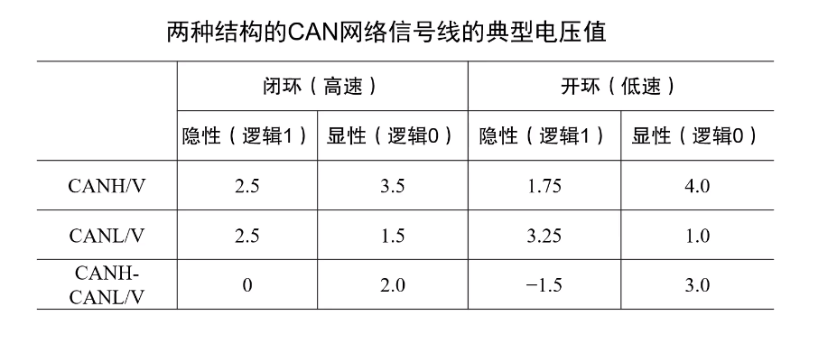
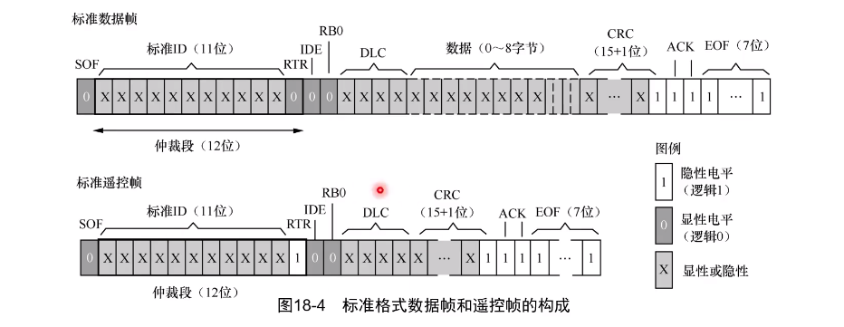
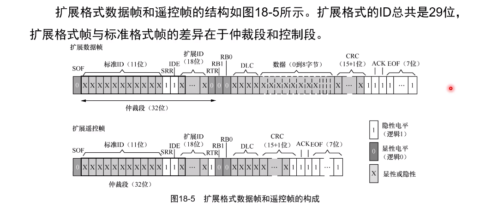
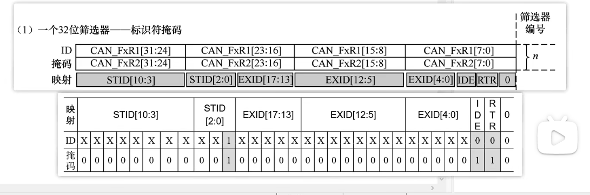
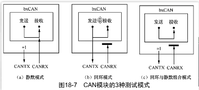
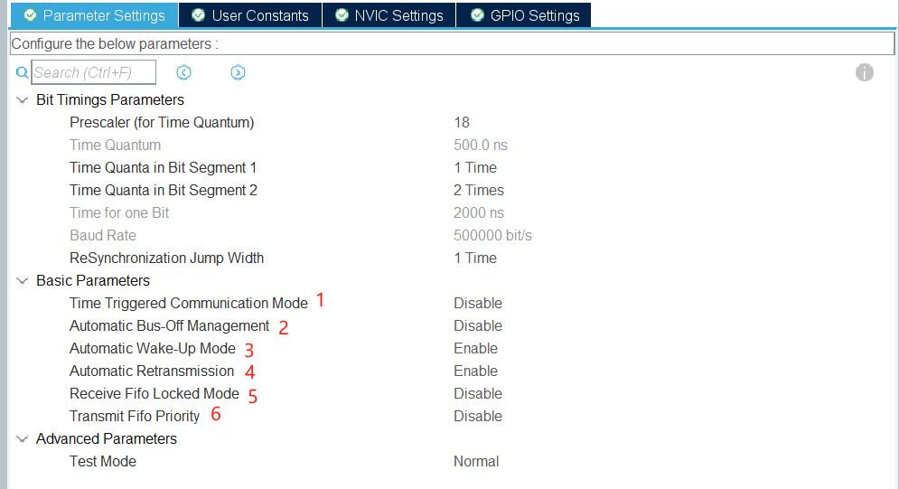

<!--
 * @Author: liuao 2494210546@qq.com
 * @Date: 2023-11-28 10:52:00
 * @LastEditors: liuao 2494210546@qq.com
 * @LastEditTime: 2023-11-28 15:57:12
 * @FilePath: \undefinedc:\Users\liuao\Desktop\CAN\CAN.md
 * @Description: 这是默认设置,请设置`customMade`, 打开koroFileHeader查看配置 进行设置: https://github.com/OBKoro1/koro1FileHeader/wiki/%E9%85%8D%E7%BD%AE
-->
# CAN
1. 闭环CAN 两根信号线相连接并在两端连接一个120欧姆的电阻，速度 125kb - 1Mb/s  在1Mb/s时总线最长40m.
2. 开环CAN 两根信号线独立各自串联一个2.2k的电阻，速度最高 125Kb/s 在40kb/s时 总线最长1000m.
3. CAN只有CAN_H CAH_L两根线，异步通信方式，差分信号.
4. 在CAN网络中没有主设备和从设备之分，但是在同一时刻只有一个节点可以发送数据，其他节点只能接收数据.
5. CAN的发送是广播的形式发送的，所有的节点都可以接收到消息，可以设置硬件筛选器，只接收自己需要订阅的消息
### CAN的电压值

### CAN的帧
 1. 数据帧:用于节点向外传送数据
 2. 遥控帧:用于向远端节点请求数据
 3. 错误帧:用于向远端节点通知校验错误，请求重新发送上一个数据
 4. 过载帧:用于通知远端节点：本节点尚未做好接收准备
 5. 过载帧:用于通知远端节点：本节点尚未做好接收准备

### 帧解析
    0 表示CAN的显性电平逻辑0     
    1 表示CAN的隐形电平逻辑1
1. 标准数据帧和标准遥控帧
    
    1. SOF : 帧起始位 显性电平 
    2. 仲裁端: 相当于优先级，那个节点先出现显性电平，那个优先级高
    3. RTR: 显性电平(0)是数据帧，隐形电平(1)是遥控帧
    4. IDE：显性电平(0)是标准帧，隐形电平(1)是扩展帧
    5. RB0: 保留位，默认显性电平
    6. DLC: 数据长度位范围为 0 - 8，表示后面数据的长度. 遥控帧的DLC位一直为0
    7. 数据: 发送的数据，个数由DLC决定
    8. CRC: 前十五位是CRC效验码，第十六位总是隐形电平，为CRC段的界定符
    9. ACK: 一个ack位一个界定符.发送节点的ack段是隐性电平，接收节点的ack段时显性电平
    10. EOF: 帧结束
2. 扩展数据帧和扩展遥控帧
    
    1. SRR: 扩展帧特有替换标准帧RTR的位置，总是隐性电平相当于一个占位符
    2. RTR: 显性电平(0)是数据帧，隐形电平(1)是遥控帧
    3. RB0 RB1: 保留位，总是显性电平


## STM32F103的CAN外设
1. 一个CAN模块有三个发送邮箱，在选定一个空闲邮箱作为发送邮箱后，CAN会自动发送写入数据
2. 一个CAN模块有两个接收FIFO，每个FIFO有三个邮箱，从邮箱中读取消息后，会由硬件自动清除


## 滤波


## STM32F103的CAN外设中断

|          CAN_TX           |            CAN_RX0            |            CAN_RX1            |           CAN_SCE            |
| :-----------------------: | :---------------------------: | :---------------------------: | :--------------------------: |
|         发送中断          |         FIFO0接收中断         |         FIFO1接收中断         |      状态改变和错误中断      |
|   邮箱发送完成产生中断    | FIFO0接收到消息、满时产生中断 | FIFO1接收到消息、满时产生中断 | 状态改变和错误中断时产生中断 |
| USB_HP_CAN1_TX_IRQHandler |  USB_LP_CAN1_RX0_IRQHandler   |      CAN1_RX1_IRQHandler      |     CAN1_SCE_IRQHandler      |
 


## CAN测试模式
1. 静默模式
2. 回环模式
3. 回环与静默模式  



## CubeMX参数配置

1. 会在发送消息时，开启一个内部计数器  
2. 自动总线关闭管理  
3. 只要接收到消息，就硬件的退出睡眠模式   
4. 发送失败，会自动重新发送，直到发送成功  
5. FIFO溢出时锁定，使得后面的消息不接收  
6. 设置发送FIF0的优先级，不使用仲裁  
## 函数功能
```C
/* 查询发送邮箱的空闲个数 */
uint32_t HAL_CAN_GetTxMailboxesFreeLevel(const CAN_HandleTypeDef *hcan);

/* 向一个邮箱写入一条消息，由CAN外设自动发送 */
HAL_StatusTypeDef HAL_CAN_AddTxMessage(CAN_HandleTypeDef *hcan, const CAN_TxHeaderTypeDef *pHeader, const uint8_t aData[], uint32_t *pTxMailbox);

/* 判断一个消息是否在发送 */
uint32_t HAL_CAN_IsTxMessagePending(const CAN_HandleTypeDef *hcan, uint32_t TxMailboxes);

/* 一个FIFO中未读消息的邮箱个数 */
uint32_t HAL_CAN_GetRxFifoFillLevel(const CAN_HandleTypeDef *hcan, uint32_t RxFifo);

/* 读取一个邮箱中的消息 */
HAL_StatusTypeDef HAL_CAN_GetRxMessage(CAN_HandleTypeDef *hcan, uint32_t RxFifo, CAN_RxHeaderTypeDef *pHeader, uint8_t aData[]);

/* 配置硬件筛选器 */
HAL_StatusTypeDef HAL_CAN_ConfigFilter(CAN_HandleTypeDef *hcan, const CAN_FilterTypeDef *sFilterConfig);
```


