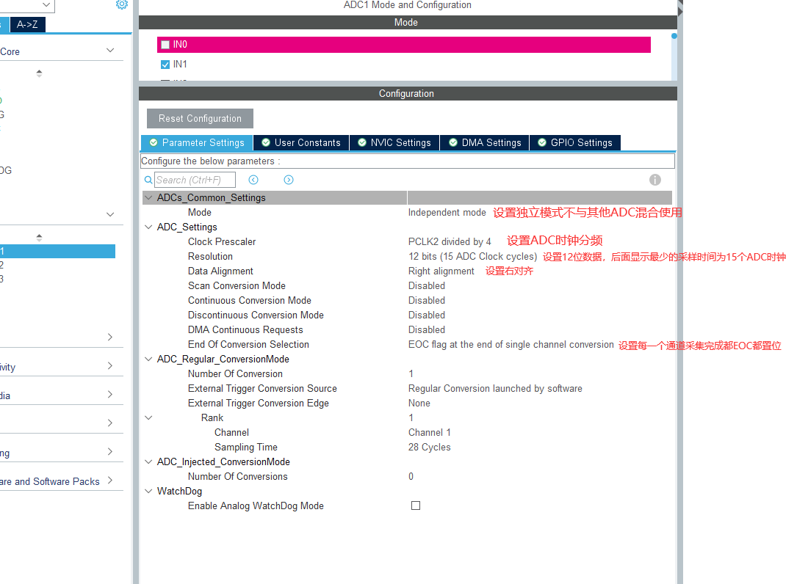

<!--
 * @Author: liuao 2494210546@qq.com
 * @Date: 2023-09-28 09:05:26
 * @LastEditors: liuao 2494210546@qq.com
 * @LastEditTime: 2023-09-28 10:38:39
 * @FilePath: \undefinedc:\Users\liuao\Desktop\E_Board-C8T6-IIC\README\readme.md
 * @Description: 这是默认设置,请设置`customMade`, 打开koroFileHeader查看配置 进行设置: https://github.com/OBKoro1/koro1FileHeader/wiki/%E9%85%8D%E7%BD%AE
-->

### CubeMX配置图

